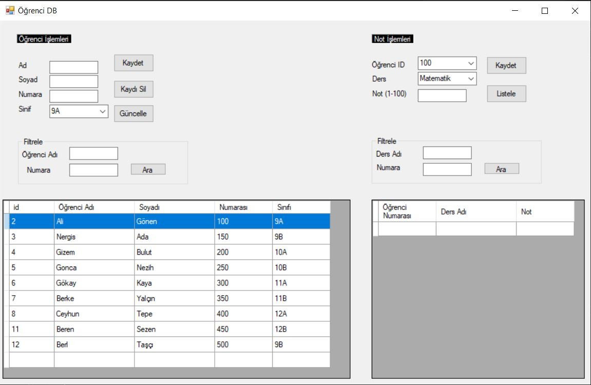
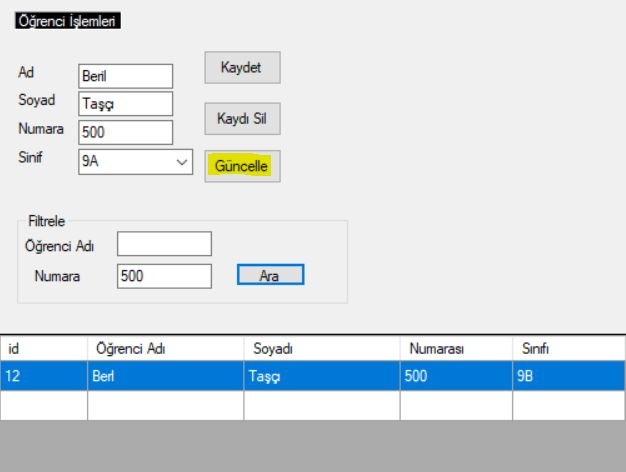
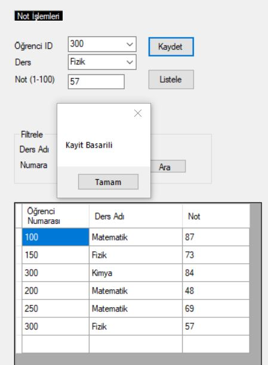
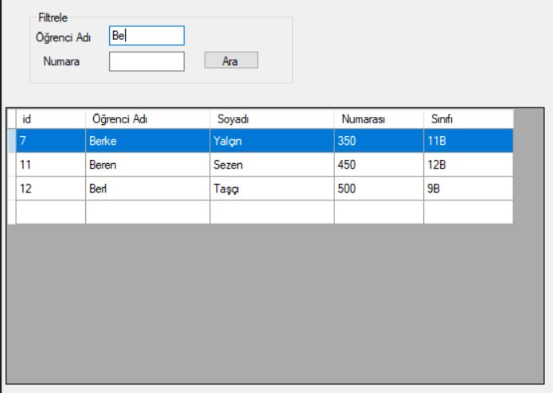

# CRUD_DesktopApp

CRUD desktop application for teacher (student and grade information)

- Database: Microsoft Access
- Editor: Visual Studio 

### CRUD
  
  - Create: Create new student and grade record.
  - Read: Filter records.
  - Update: Change the records.
  - Delete: Delete the records.

### View

### Create / Update / Delete Student Record

### Create Grade Record

### Filtering Students

### Filtering Grades

